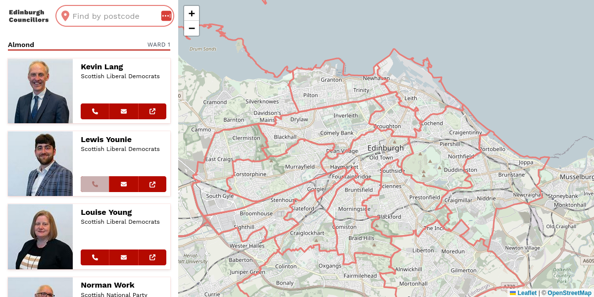

# :wave: Hiya!

This is a small app to find your ward councillors for the city of Edinburgh, Scotland. View the [live demo](https://natewr.github.io/edinburgh-councillors/).

[](https://natewr.github.io/edinburgh-councillors/)

I built this as a quick sample for my portfolio using:

- [Cypress](https://www.cypress.io/) to [scrape the data](https://github.com/NateWr/edinburgh-councillors/blob/main/cypress/e2e/councillors.cy.js),
- [Node.js](https://nodejs.org) and [sharp](https://www.npmjs.com/package/sharp) to [download and resize the photos](https://github.com/NateWr/edinburgh-councillors/blob/main/src/tools/getphotos.js),
- [Leaflet](https://leafletjs.com/) to draw the map and ward boundaries ([GeoJSON data](https://data.edinburghcouncilmaps.info/datasets/dc96624b1db849db926f59806e287d44/explore) from Edinburgh City Council),
- [Postcode data](https://www.doogal.co.uk/AdministrativeAreas?district=S12000036) from doogal.co.uk to implement postcode lookup,
- and [Vue.js](https://vuejs.org/) and [Vite](https://vitejs.dev/) to build the app.

## Usage

Install the dependencies using [npm](https://www.npmjs.com/) (or your favourite JavaScript package manager).

```
npm install
```

Scrape the data.

```
npm run data
```

Run the app locally.

```
npm run dev
```

To build the app for production, adjust the `base` URL in `vite.config.js` and run the following.

```
npm run build
```

## A note on the data

I built this in early 2023 so the data may be out of date. Find your current ward councillors at [edinburgh.gov.uk](https://democracy.edinburgh.gov.uk/mgMemberIndex.aspx).

